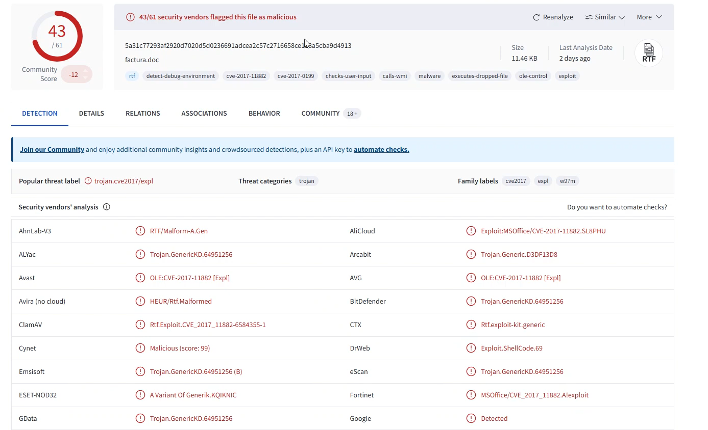
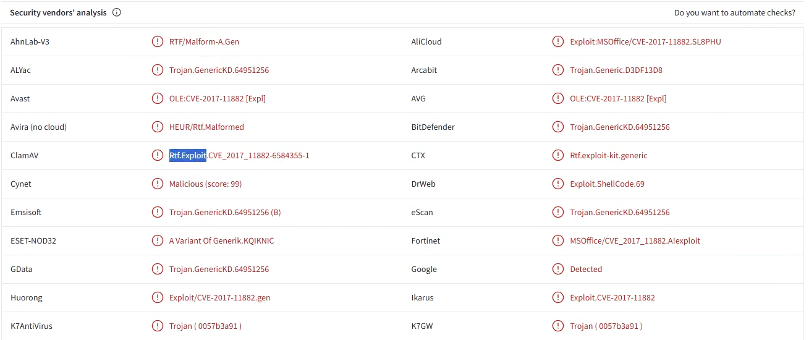
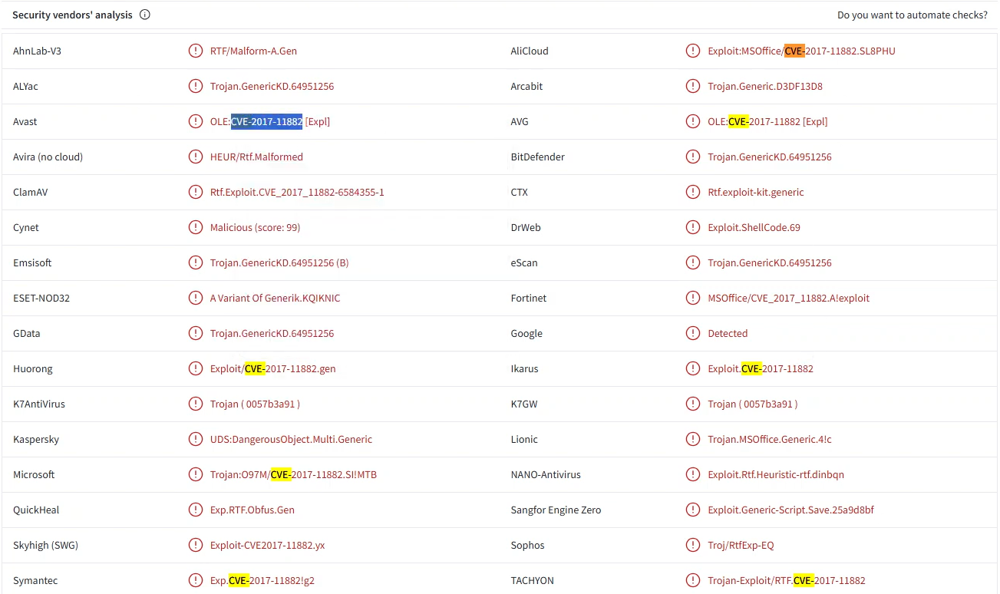
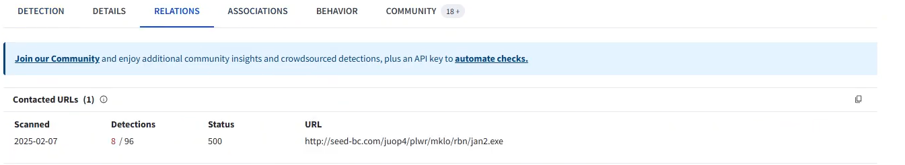
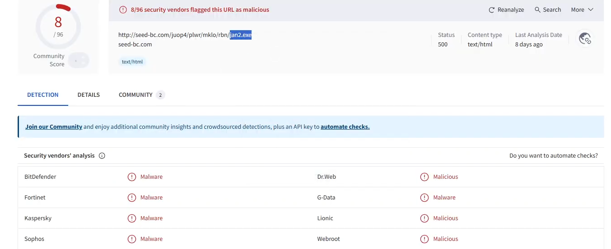
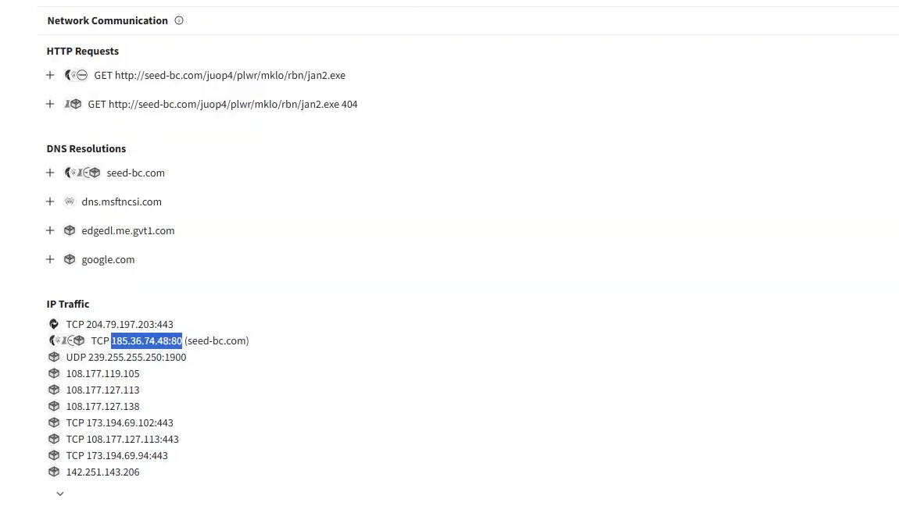
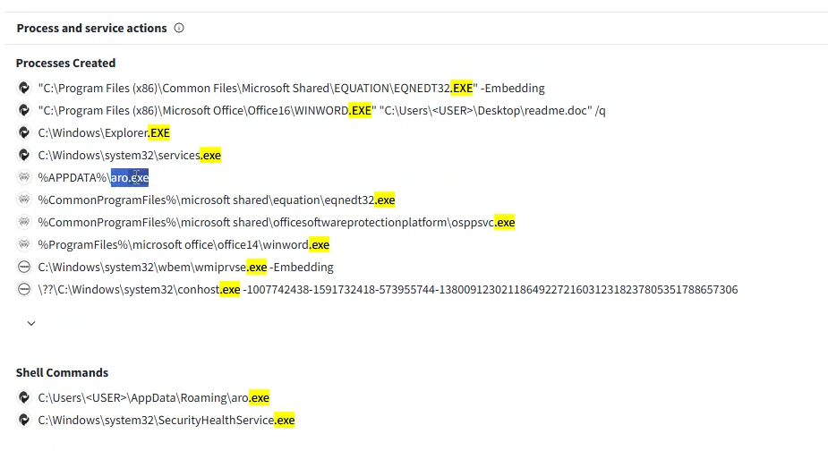

## Malicious Doc

## Overview
In this analysis, I conducted an analysis on a malicious document sample in a controlled lab environment courtesy of LetsDefend. The objective was to identify its behavior, associated exploit, and any malicious activity triggered upon execution.

## Analysis Initiation
I was given a malicious archive named `factura.zip`. I extracted the file using the password `infected` and obtained the document `factura.doc`, which I used for the analysis.

---

## VirusTotal Analysis

### i) Popular Threat Label
I uploaded the document to VirusTotal to analyze it across multiple security vendors. The results showed that **43/61 security vendors flagged the file as malicious**.

The popular threat label identified was:
**trojan.cve2017/expl**

---

### ii) What type of exploit is running?
From the analysis results, I identified the exploit type associated with the file as:

**RTF Exploit**

This indicates the document leverages a crafted Rich Text Format structure to execute code and trigger memory corruption on the victim machine.

---

### iii) Relevant Exploit CVE Code
I filtered for CVE-related information within VirusTotal and identified the exploit vulnerability as:

**CVE-2017-11882**
as shown in the image below.

This vulnerability (CVE-2017-11882) exploits the Microsoft Office Equation Editor, a legacy component lacking modern security protections, allowing attackers to execute arbitrary code without user interaction.

---

### iv) Malicious Software Downloaded
To identify the payload delivered after execution, I navigated to the **Relations** tab and selected **Contacted URLs**, focusing on entries with detections (basically the one with **8/96 detections**).

From deeper analysis of the contacted URL, I identified the downloaded malware:

* **File Name:** jan2.exe  
* **URL:** http://seed-bc.com/juop4/plwr/mklo/rbn/jan2.exe  

The file was flagged as malicious by several vendors including:

* BitDefender  
* Fortinet  
* Kaspersky  
* Sophos  

This confirms that the document acts as an initial access vector, downloading a secondary payload (jan2.exe) from an external server, indicating a staged malware infection.

---

### v) IP Address and Port Communication
I navigated to the **Behavior** section to analyze runtime activity, specifically focusing on network communication.

From this section, I identified the communication details:

* **IP Address:** 185.36.74.48  
* **Port:** 80  
* **Domain:** seed-bc.com  

This indicates that the malware establishes Command and Control (C2) communication with a remote server over HTTP (port 80), allowing the attacker to send commands, download additional payloads, or exfiltrate data from the infected system.

---

### vi) Dropped Executable File
Still within the **Behavior** section, I filtered for `.exe` files and analyzed the **Process Created** events.

I identified the dropped executable as:

**aro.exe**

The creation of aro.exe indicates successful payload execution and suggests the establishment of persistence or further post-exploitation activity on the system.

---

## Conclusion
The analysis confirms that `factura.doc` is a malicious document exploiting CVE-2017-11882 for initial code execution. The document proceeds to download a secondary payload (jan2.exe), establish Command and Control (C2) communication, and deploy an additional executable (aro.exe) for persistence and continued attacker control.

This behavior aligns with common real-world attack patterns involving initial access, payload delivery, C2 communication, and post-exploitation persistence.

No evidence of lateral movement was observed during the analysis.

---

## Remediation and Response
Although this was conducted in a simulated lab, in a real-world scenario I would:

* Delete the malicious document (`factura.doc`) from the system  
* Remove the downloaded payload (`jan2.exe`)  
* Delete the dropped executable (`aro.exe`)  
* Terminate all malicious processes created  
* Block the IP address **185.36.74.48** and domain `seed-bc.com`  
* Perform a full system scan using endpoint protection tools  
* Isolate the infected machine to prevent lateral movement  
* Monitor network traffic for any further suspicious activity  
