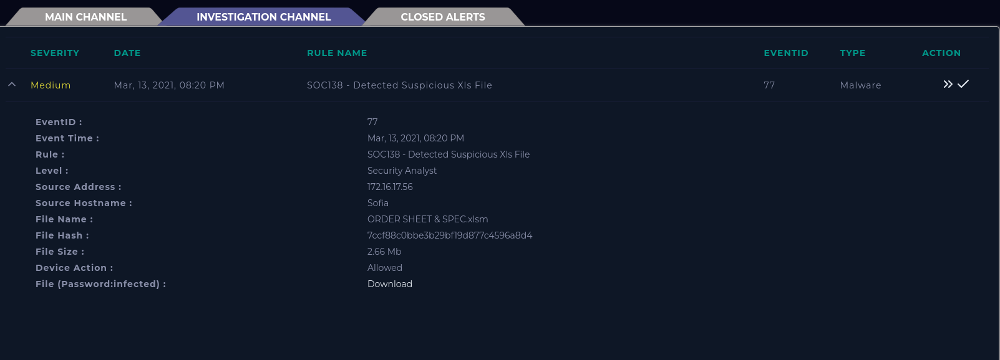
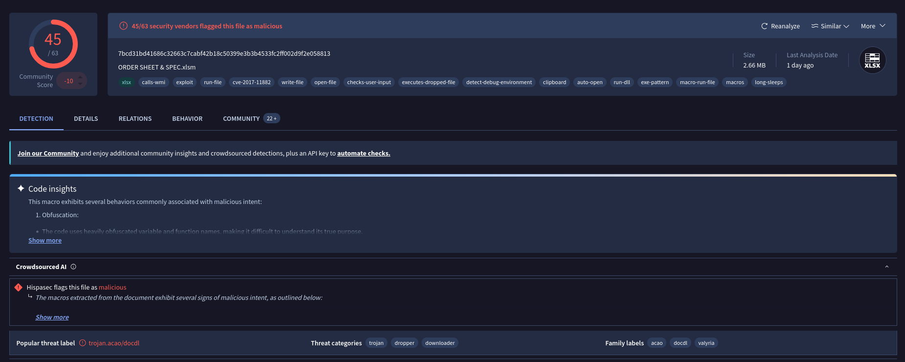
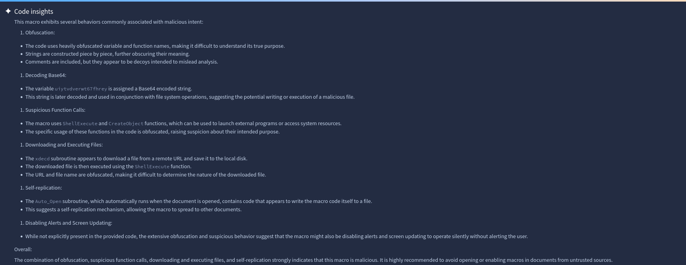
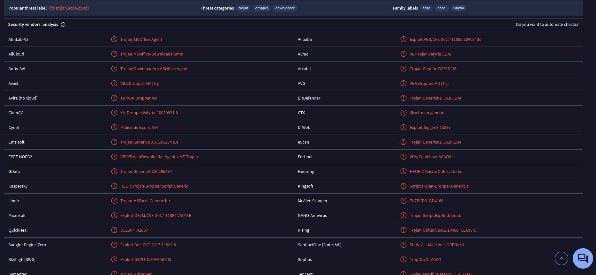
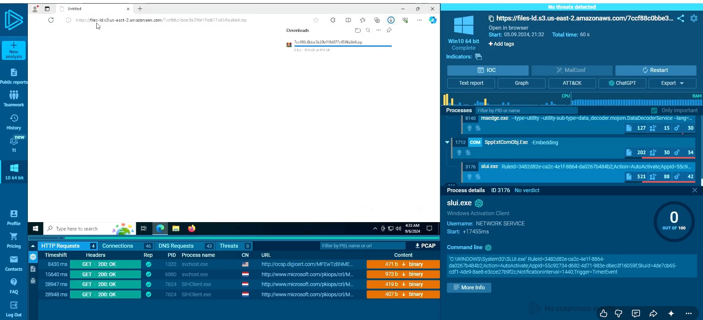
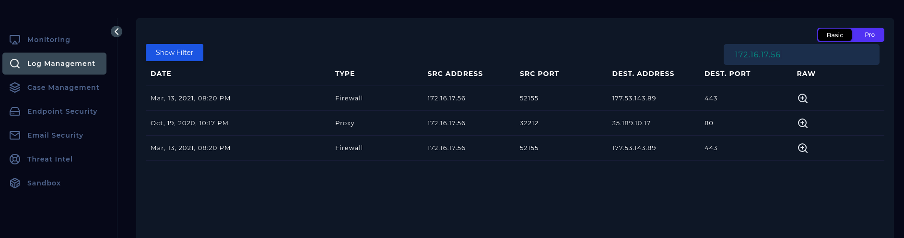
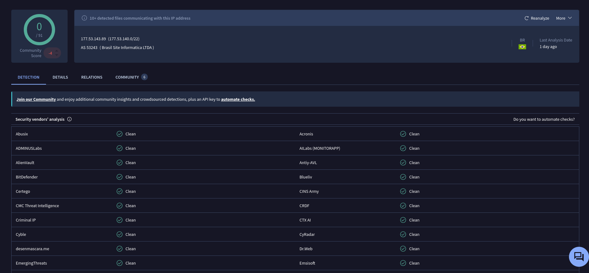
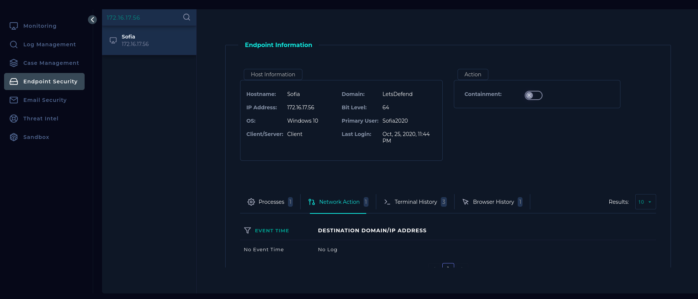
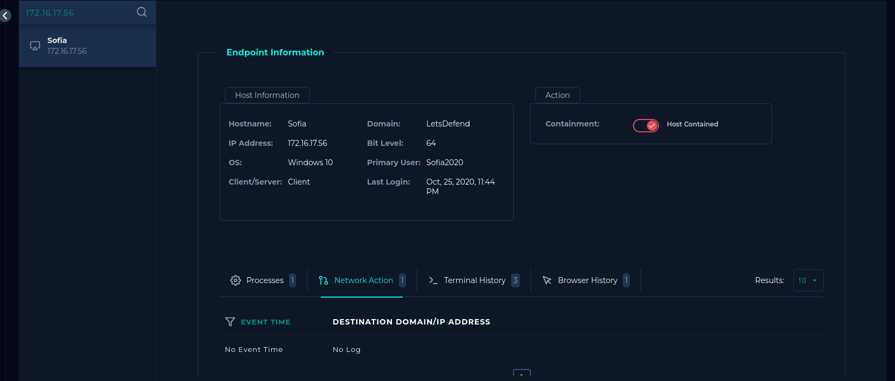

# EventID: 77-SOC-138 — Detected Suspicious XLS File

##  Overview

In this investigation, I analyzed a security alert triggered by the detection of a suspicious XLS (Excel macro-enabled) file within the environment. Such files are commonly leveraged to deliver malware through embedded macros. My objective was to determine whether the alert represented a true threat and assess the extent of compromise.

---

## a) Alert Details

* **Severity:** Medium
* **Device Action:** Allowed
* **Source Hostname:** Sofia
* **Source IP Address:** 172.16.17.56

**Screenshot:** 

---

## b) Malware Analysis

### i) MD5 Hash Analysis (VirusTotal)

I analyzed the file’s MD5 hash on VirusTotal and found that **45 out of 63 security vendors flagged the file as malicious**, indicating a high probability of compromise.

**Screenshot:** 

---

### ii) Code Insights (VirusTotal)

The macro embedded within the XLS file exhibited multiple behaviors commonly associated with malicious activity, including suspicious execution patterns and obfuscation techniques.

**Screenshot:** 

---

### iii) Security Vendors’ Analysis

Further analysis revealed that the **most common threat classification** was:

> `trojan.acao/docdl`

Additionally, reputable vendors such as **Alibaba** and **Skyhigh** identified the file as an exploit, reinforcing the malicious classification.

**Screenshot:** 

---

##  c) Sandbox Analysis (Any.Run)

I performed dynamic analysis using Any.Run by submitting the file URL in a controlled virtual environment.

Upon execution:

* An **untitled window opened automatically**
* A **ZIP file began downloading without user interaction**

This behavior is highly suspicious and indicative of malware delivery.

Further observations:

* **46 total connections**
* **4 HTTP requests**
* **43 DNS requests**

This pattern suggests **unexpected outbound communication**, a strong indicator of compromise.

**Screenshot:** 

---

## d) Log Analysis (LetsDefend)

Using the Log Management page, I searched for activity related to the source IP address.

Findings:

* Two connections were made to **IP address 177.53.143.89**
* Timestamp: **March 13, 2021 at 8:20 PM**
* This aligns exactly with the alert generation time

This confirms that the malware was **not quarantined or blocked**, and communication was established.

**Screenshot:** 

---

### Additional IP Analysis

I further investigated the destination IP (**177.53.143.89**) on VirusTotal. No immediate malicious indicators were found; however, this does not rule out its involvement in command-and-control (C2) activity.

**Screenshot:** 

---

## e) Endpoint Analysis (EDR)

I reviewed the endpoint (**172.16.17.56**) on the EDR platform. No obvious suspicious activity was detected at first glance.

**Screenshot:** 

---

##  f) C2 Communication Verification

Further log analysis confirmed that:

* The destination IP (**177.53.143.89**) communicated with the source endpoint
* The interaction occurred **at the exact same time the malicious file was executed**

This strongly indicates that:

* The malicious file was successfully executed
* A **Command-and-Control (C2) connection was established**

The raw logs associated with these connections contained suspicious data patterns, reinforcing this conclusion.

**Screenshot:** 

---

## g) Containment

To prevent further spread, I **contained the affected endpoint (172.16.17.56)** via the EDR platform.

**Screenshot:**  

---

##  Conclusion

Based on the evidence gathered across static analysis, dynamic analysis, and log correlation, I conclude that:

> **This alert is a TRUE POSITIVE.**

The system has been compromised, and immediate remediation is required.
I recommend a **“Nuke and Pave”** approach (full system wipe and rebuild) to ensure complete eradication of the threat.

---

##  h) Recommended Remediations

1. **Full System Reinstallation (Nuke and Pave)**
   Completely wipe and reinstall the operating system to eliminate any persistence mechanisms or hidden malware components.

2. **Endpoint Isolation and Monitoring**
   Keep the affected device isolated until remediation is complete and continuously monitor for any residual suspicious activity.

3. **User Awareness Training**
   Educate users on the risks of opening unknown or suspicious email attachments, especially macro-enabled documents.

4. **Macro Execution Restrictions**
   Enforce group policies to disable or restrict macro execution from untrusted sources to prevent similar attacks.

5. **Network Traffic Monitoring and Blocking**
   Implement stricter network controls to detect and block suspicious outbound connections, particularly to unknown external IPs.

---

##  j) Playbook Performance

* **Playbook Score:** 100%
* **Success Rate:** 100%

**Playbook Link:** https://app.letsdefend.io/case-management/casedetail/alvine12w/77

---

